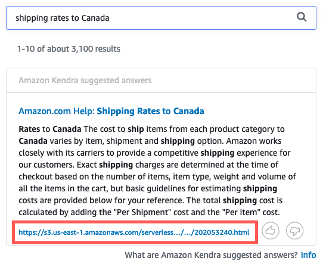

# Step 6. Query the index

이제 텍스트 검색 콘솔을 사용하여 새로 만든 인덱스를 쿼리할 수 있습니다. 이것은 인덱스를 쿼리할 수 있는 여러 가지 방법 중 하나입니다. 색인을 검색할 때 아마존 켄드라는 사용자가 제공한 모든 정보를 사용하여 검색 질의에 가장 정확한 답변과 관련 문서를 반환합니다.

다음 단계를 완료하여 새로 만든 인덱스를 쿼리합니다.

**Note:** For more information, see [Searching indexes](https://docs.aws.amazon.com/kendra/latest/dg/searching.html) in the Amazon Kendra documentation.

a. **Amazon Kendra 콘솔**의 왼쪽 탐색 창에서 **Search console**을 선택합니다. 검색 상자에 첫 번째 쿼리를 입력합니다. 아마존 음악은 무제한이 무엇인가요?

결과 상단에는 Amazon Kendra가 반환한 결과를 확인할 수 있다.

b. 다음, 다른 쿼리를 입력합니다: _shipping rates to Canada_

Amazon Kendra가 반환한 또 다른 결과를 볼 수 있습니다.

c. 보다 직접적인 질의를 입력합니다. _How do I sign up for the Amazon Prime free Trial?_

결과에서 Amazon Kendra가 색인화된 문서에서 뽑아낸 추천 답변과 함께 FAQ 데이터 소스의 새로운 답변을 확인할 수 있다.

.png>)
